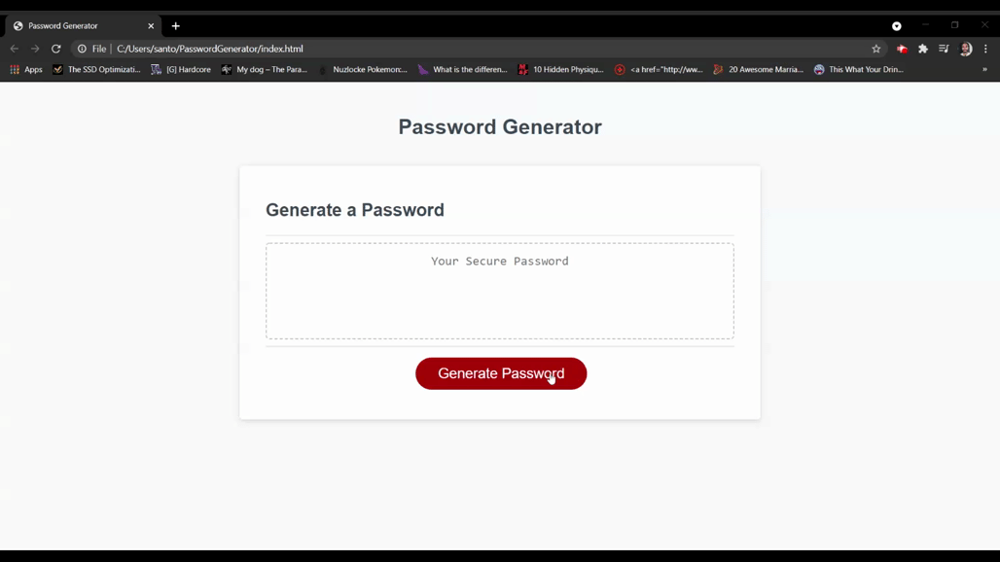

# PasswordGenerator
## Project Description
### Ever wondered how to generate a password that is complex but still easy to create? Look no further.

This project is for a web app that will generate a random password using 4 different sets of criteria. It will ask the user (you) for the number of characters or length, the presence of numbers, lower and upper case letter as well as selection of special characters. It will then almost instantly generate and display a string of characters that you can copy and use as a password.

## Project Process
I began by working on the series of prompts that would obtain input from the user on the properties of the password. These inputs would then be used by the functions to create the password. This was easier said than done. Through the use of if statements, I was able to test the value given for length and make sure it was first a number, and then fell between the desired length of 8 to 128 characters. Moving on to the 4 different character types, I took a while longer to develop a process to both accept user input and create an array that included the correct values. This was also done through 4 similar functions that asked the user for confirmation to include the set of values. An additional function was created to make sure at least one of the values was chosen. If not, it would restart the character type selection process. Finally, the last function used all the values obtained from the previous functions and randomly selected characters from the final array, creating a new one. This was then joined together and returned as the result to be displayed on the web page.

## Project Link
See link:
https://pricosaint.github.io/PasswordGenerator/
## Project Screenshot
See screenshot for general functionality:
